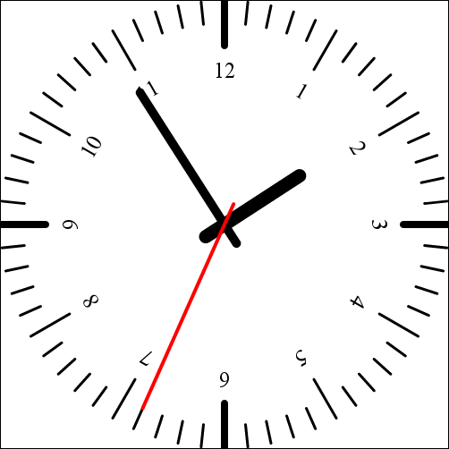

 
# Sunroof: Clockwork Progress

About nine months ago we 
[presented the idea][BlogSunroofIntro] 
to use reification of a monad
to implement a JavaScript compiler.
The compiler made some progress and now 
[we released it][HackageSunroofCompiler].

As a small teaser of what you can do with Sunroof, we 
present the clock example. It demonstrates how Sunroof 
can produce self-contained 
JavaScript that renders a clock using the HTML5 canvas element.

**TODO:** Possible to insert the canvas element and JavaScript call in here?
          Fancy clock running in the website?

<canvas 
      id="canvas" 
      style="padding: 0px; margin: 0px; border: solid 1px black" 
      width="500" 
      height="500"
      class="click">
</canvas>

**TODO:** Does this work on the blog?

The JavaScript API for HTML5 canvas element is already provided by 
Sunroof in the module `Language.Sunroof.JS.Canvas`. 
Lets look how we can render one line of the clock face using Sunroof:

    c # save
    -- Draw one of the indicator lines
    c # beginPath
    c # moveTo (0, -u * 1.0)
    ifB (n `mod` 5 ==* (0 :: JSNumber))
        (c # lineTo (0, -u * 0.8)) -- Minute line
        (c # lineTo (0, -u * 0.9)) -- Hour line
    ifB (n `mod` 15 ==* (0 :: JSNumber))
        (c # setLineWidth 8) -- Quarter line
        (c # setLineWidth 3) -- Non-Quarter line
    c # stroke
    c # closePath
    -- Draw of the hour numbers
    ifB (n `mod` 5 ==* (0 :: JSNumber))
        (do
          c # translate (-u * 0.75, 0)
          c # rotate (-2 * pi / 4)
          c # fillText (cast $ n `div` 5) (0, 0)
        ) (return ())
    c # restore

The monadic `do`-notation is used for sequencing 
JavaScript statements in a neat fashion.

The first few lines probably look familiar to people how have written 
JavaScript before.

    c # save
    -- Draw one of the indicator lines
    c # beginPath
    c # moveTo (0, -u * 1.0)

The `#`-operator is used instread of the `.`-operator in JavaScript.
`u` represents the radius of the clock. Knowing this you can see 
that we are calling methods on the JavaScript object `c` (Our canvas context).
The methods without parameters do not require empty paranthesis, as
a Hasekell programmer would expect. The tuple used in the call of `moveTo`
is only there to indicate that this parameter is a coordinate, not 
two single numbers. You can also see that JavaScript numbers are neatly
embedded using the `Num`-class and can be used naturally.

The next few lines show a branch.

    ifB (n `mod` 5 ==* (0 :: JSNumber))
        (c # lineTo (0, -u * 0.8)) -- Minute line
        (c # lineTo (0, -u * 0.9)) -- Hour line

Haskell lacks the possibilities to deep embed branches and
boolean expressions. For that reason we are using the 
[`Data.Boolean`][HackageBoolean] package. Instead of `if-then-else`
you are required to use `ifB` when writing JavaScript.

    ifB (n `mod` 5 ==* (0 :: JSNumber))
        (do
          c # translate (-u * 0.75, 0)
          c # rotate (-2 * pi / 4)
          c # fillText (cast $ n `div` 5) (0, 0)
        ) (return ())

Note the cast operation in the fifth line. As Haskells type
system is more restrictive then the one used in JavaScript, we sometimes
have to `cast` one JavaScript value to another. This may seem more
complicated then writing the JavaScript by hand, but when using 
the API correctly (by not working around it) compile time
errors can show mistakes in the JavaScript code early.

Getting back to the initial code block: How do we render the other 
59 lines of the clock face? We just wrap this code into a function.
Of course, we do this at JavaScript level.

    renderClockFaceLine <- function $ \(c :: JSCanvas, u :: JSNumber, n :: JSNumber) -> do
      ...

We have just created the JavaScript function `renderClockFaceLine` with the 
three needed parameters (though it will not have that exact name). 
So lets render the complete clock face using
the `forEach`-method provided by arrays.

    c # save
    c # rotate (2 * pi / 4) -- 0 degrees is at the top
    -- Draw all hour lines.
    array [1..60::Int] # forEach $ \n -> do
      c # save
      c # rotate ((2 * pi / 60) * n)
      renderClockFaceLine $$ (c, u, n)
      c # restore
    c # restore -- Undo all the rotation.

The `array` combinator converts the list into a JavaScript array. The supplied 
function for the loop body takes the current element as a parameter.
In the loop body you can see how the `$$`-operator is used just as
the `$`-operator in Haskell to apply a JavaScript function to arguments. 
As the usefulness of partial 
application is questionable in the context of deep embedded JavaScript, 
we only allow tuples as parameters to functions.

Using these techniques we can render the clock with about 90 
lines of Haskell.

    clockJS :: JS A (JSFunction () ())
    clockJS = function $ \() -> do
      -- Renders a single line (with number) of the clock face.
      renderClockFaceLine <- function $ \(c :: JSCanvas, u :: JSNumber, n :: JSNumber) -> do
        c # save
        -- Draw one of the indicator lines
        c # beginPath
        c # moveTo (0, -u * 1.0)
        ifB (n `mod` 5 ==* 0)
            (c # lineTo (0, -u * 0.8)) -- Minute line
            (c # lineTo (0, -u * 0.9)) -- Hour line
        ifB (n `mod` 15 ==* 0)
            (c # setLineWidth 8) -- Quarter line
            (c # setLineWidth 3) -- Non-Quarter line
        c # stroke
        c # closePath
        -- Draw of the hour numbers
        ifB (n `mod` 5 ==* 0)
            (do
              c # translate (-u * 0.75, 0)
              c # rotate (-2 * pi / 4)
              c # fillText (cast $ n `div` 5) (0, 0)
            ) (return ())
        c # restore
      -- Renders a single clock pointer.
      renderClockPointer <- function $ \(c :: JSCanvas, u :: JSNumber, angle :: JSNumber, width :: JSNumber, len :: JSNumber) -> do
        c # save
        c # setLineCap "round"
        c # rotate angle
        c # setLineWidth width
        c # beginPath
        c # moveTo (0, u * 0.1)
        c # lineTo (0, -u * len)
        c # stroke
        c # closePath
        c # restore
      -- Renders the clocks pointers for hours, minutes and seconds.
      renderClockPointers <- function $ \(c :: JSCanvas, u :: JSNumber) -> do
        (h, m, s) <- currentTime
        c # save
        c # setLineCap "round"
        -- Hour pointer
        renderClockPointer $$
          (c, u, (2 * pi / 12) * ((h `mod` 12) + (m `mod` 60) / 60), 15, 0.4)
        -- Minute pointer
        renderClockPointer $$
          ( c, u, (2 * pi / 60) * ((m `mod` 60) + (s `mod` 60) / 60), 10, 0.7)
        -- Second pointer
        c # setStrokeStyle "red"
        renderClockPointer $$ ( c, u, (2 * pi / 60) * (s `mod` 60), 4, 0.9)
        -- Restore everything
        c # restore
      -- Renders the complete face of the clock, without pointers.
      renderClockFace <- function $ \(c :: JSCanvas, u :: JSNumber) -> do
        c # save
        c # rotate (2 * pi / 4) -- 0 degrees is at the top
        -- Draw all hour lines.
        array [1..60::Int] # forEach $ \n -> do
          c # save
          c # rotate ((2 * pi / 60) * n)
          renderClockFaceLine $$ (c, u, n)
          c # restore
        c # restore -- Undo all the rotation.
      -- Renders the complete clock.
      renderClock <- continuation $ \() -> do
        u <- clockUnit
        (w,h) <- canvasSize
        c <- context
        -- Basic setup
        c # save
        c # setFillStyle "black"
        c # setStrokeStyle "black"
        c # setLineCap "round"
        c # setTextAlign "center"
        c # setFont ((cast $ u * 0.1) <> "px serif")
        c # setTextBaseline "top"
        c # clearRect (0,0) (w,h)
        c # translate (w / 2, h / 2)
        -- Draw all hour lines.
        renderClockFace $$ (c, u)
        -- Draw the clock pointers
        renderClockPointers $$ (c, u)
        c # restore
        return ()
      window # setInterval (goto renderClock) 1000
      -- and draw one now, rather than wait till later
      goto renderClock ()

      return ()

Using the `sunroofCompileJSA` we can compile 
the deep embedded JavaScript into a string of actual JavaScript.

    sunroofCompileJSA def "main" clockJS >>= writeFile "main.js"

The compiled string will contain a function `main` 
that executes our JavaScript. This is then called 
in the HTML file to execute.

There are a few small utilities used in the code. The current
time is percieved by `currentTime` which uses the JavaScript 
date API provided by the module `Language.Sunroof.JS.Date`.

    currentTime :: JS A (JSNumber, JSNumber, JSNumber)
    currentTime = do
      date <- newDate ()
      h <- date # getHours
      m <- date # getMinutes
      s <- date # getSeconds
      return (h, m, s)

Note that this will literally copy the JavaScript produced by `currentTime`
to where it is used, because it is not abstracted to a function in JavaScript.
Every time you write Sunroof code that is not wrapped in a function, the
Haskell binding will function like a macro.

The other helpers are just shortcuts to get certain values:

    canvas :: JS A JSObject
    canvas = document # getElementById "canvas"

    context :: JS A JSCanvas
    context = canvas >>= getContext "2d"

    clockUnit :: JS A JSNumber
    clockUnit = do
      (w, h) <- canvasSize
      return $ (maxB w h) / 2

    canvasSize :: JS A (JSNumber, JSNumber)
    canvasSize = do
      c <- jQuery "#canvas"
      w <- c # invoke "innerWidth" ()
      h <- c # invoke "innerHeight" ()
      return (w, h)

As you can see Sunroof is easy to use and reflects the generated JavaScript
closely. But there is much more to Sunroof then this small example shows.
Sunroof also offers an abstraction over the JavaScript threading model.
This enables you to use Haskell concurrency patterns like `MVar` or
`Chan` in the Sunroof code (`JSMVar` and `JSChan`).

The [`sunroof-server` package][HackageSunroofServer] offers a ready to
use webserver to deploy generated JavaScript on the fly. It
enables you to interleave Haskell and JavaScript computations
as needed, through synchronous or asynchronous calls.

[A number of examples][GitHubSunroofWikiExamples] and 
[a tutorial][GitHubSunroofWikiTutorial] is provided on 
[GitHub][GitHubSunroofExamples].
You can see [the example in action here][ExampleRunning], 
the [produced JavaScript looks like this][ExampleJavaScript]
and the [Haskell sources can be found on github][GitHubSunroofClock].
They are part of the [`sunroof-examples` package][HackageSunroofExamples].

[BlogSunroofIntro]: http://www.ittc.ku.edu/csdlblog/?p=88 "Monad Reification in Haskell and the Sunroof JavaScript compiler"

[ExampleRunning]: TODO "The clock example"
[ExampleJavaScript]: TODO "Clock example JavaScript sources"

[HackageBoolean]: http://hackage.haskell.org/package/Boolean-0.1.2 "Hackage: Boolean"
[HackageSunroofCompiler]: http://hackage.haskell.org/package/sunroof-compiler "Hackage: sunroof-compiler"
[HackageSunroofServer]: http://hackage.haskell.org/package/sunroof-server "Hackage: sunroof-server"
[HackageSunroofExamples]: http://hackage.haskell.org/package/sunroof-examples "Hackage: sunroof-examples"

[GitHubKansasComet]: https://github.com/ku-fpg/kansas-comet "kansas-comet repository"
[GitHubSunroofCompiler]: http://hackage.haskell.org/package/sunroof-compiler "sunroof-compiler repository"
[GitHubSunroofServer]: http://hackage.haskell.org/package/sunroof-server "sunroof-server repository"
[GitHubSunroofExamples]: http://hackage.haskell.org/package/sunroof-examples "sunroof-examples repository"

[GitHubSunroofClock]: https://github.com/ku-fpg/sunroof-examples/blob/master/examples/clock/Main.hs "Clock examples Haskell sources"
[GitHubSunroofWikiExamples]: https://github.com/ku-fpg/sunroof-compiler/wiki/Examples "Example descriptions"
[GitHubSunroofWikiTutorial]: https://github.com/ku-fpg/sunroof-compiler/wiki/Tutorial "Sunroof Tutorial"

